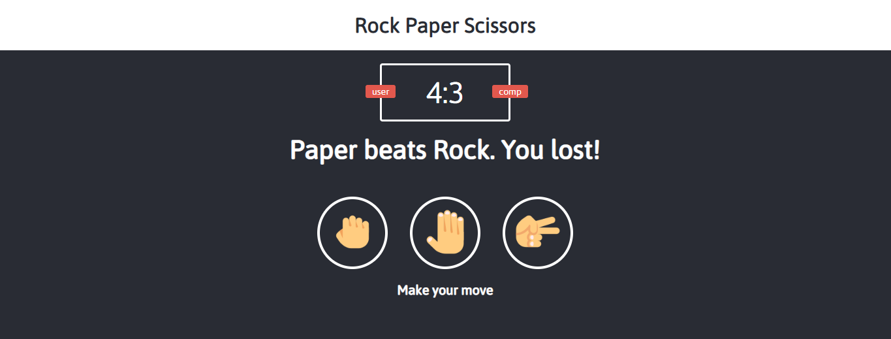

# Rock-Paper-Scissors Game
Play the classic Rock-Paper-Scissors game in a most interesting way. You will be asked to make a move and then it will be the devices's turn, finally telling the winner.

## How to use
1. Clone the using `git clone https://github.com/NShadyy/rock-paper-scissors-game.git`
2. Go to project directory `cd rock-paper-scissors-game`
3. `npm install`
4. `npm run build` for dev build with webpack dev server, in this case open the url in your browser - http://localhost:8080
5. `npm run build:prod` for production build - in this case just open the `index.html` file in your browser

### Here's the link to play it
http://nakul-rock-paper-scissors-game.s3-website.ap-south-1.amazonaws.com/
